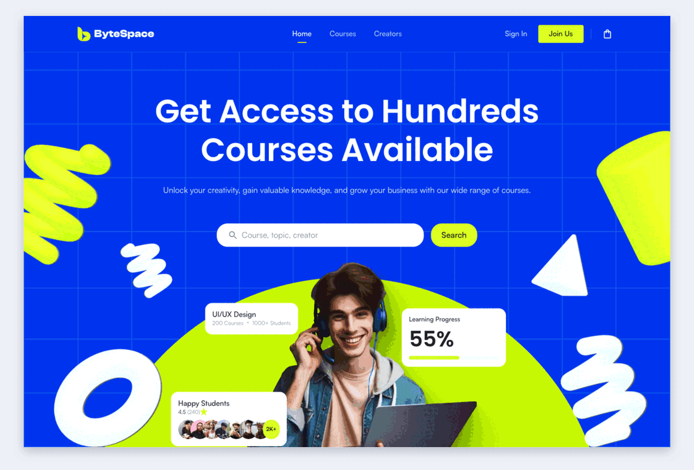
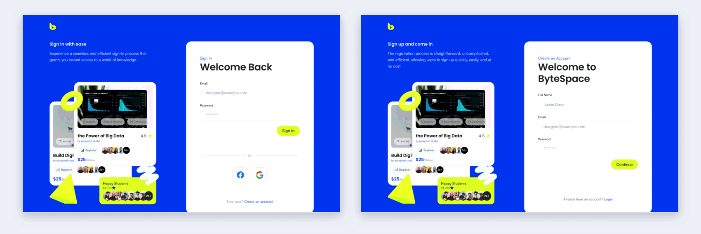
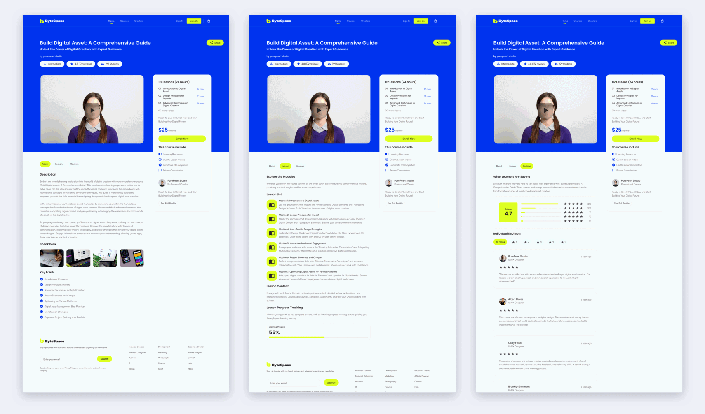
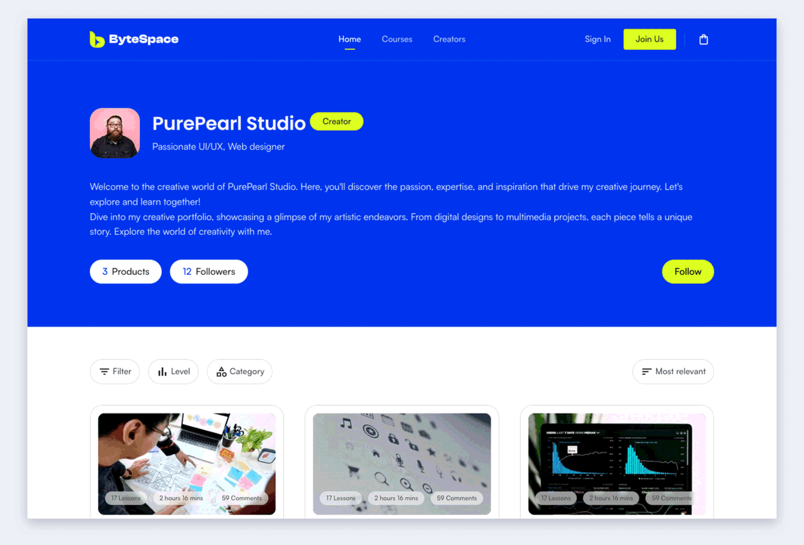

<a name="top"></a>

<div align="center">

# ByteSpace New

### An online-learning platform, built pixel-accurate from a Figma design

ByteSpace New is a front-end implementation of a course marketplace: a landing page, sign in and
registration, course search, course details with lessons and reviews, and a creator profile. All
content is typed static data, so there is no backend to set up.

<p>
  
  
  
  
  
</p>

**[Live demo](LIVE_URL_HERE)** · **[Preview](#preview)** · **[Getting started](#getting-started)**

</div>

---

<details>
<summary><strong>Table of contents</strong></summary>

- [Preview](#preview)
- [Screenshots](#screenshots)
- [About the project](#about-the-project)
- [Features](#features)
- [Pages and routes](#pages-and-routes)
- [Tech stack](#tech-stack)
- [Getting started](#getting-started)
- [Project structure](#project-structure)
- [Design reference](#design-reference)
- [Deployment](#deployment)
- [Author](#author)

</details>

---

## Preview

<p align="center">
  <a href="docs/preview.mp4"></a>
</p>

<p align="center"><sub>Click the animation to open the full-quality MP4.</sub></p>

The walkthrough covers the home page, course search, a course with its lessons and reviews,
a creator profile, and the sign in and registration screens.

**Live demo:** [LIVE_URL_HERE](LIVE_URL_HERE)

<p align="right"><a href="#top">Back to top</a></p>

---

## Screenshots

### Home

<p align="center"></p>

<p align="center"><sub>Landing page, first screen. The full page also has partners, course categories, learning paths, testimonials and a footer.</sub></p>

### Sign in and registration

<p align="center"></p>

<p align="center"><sub>Sign in (left) and registration (right) share one split layout.</sub></p>

### Course pages

<p align="center"></p>

<p align="center"><sub>Course details, lessons and reviews (left to right), with the shared enrolment sidebar.</sub></p>

### Creator profile

<p align="center"></p>

<p align="center"><sub>Creator profile with bio, follower stats and the creator's courses.</sub></p>

<p align="right"><a href="#top">Back to top</a></p>

---

## About the project

The project was built from a Figma file that contains 1440 px desktop frames only. Layouts for
smaller screens are inferred from the desktop design. Pages are checked against the Figma frames
by comparing rendered output and text positions.

The code follows a fixed folder architecture. Routes live in `app/`, business logic lives in
`features/`, and shared code lives in `components/` and `lib/`. Feature boundaries are enforced
by ESLint, so a feature cannot import another feature.

<p align="right"><a href="#top">Back to top</a></p>

---

## Features

- Landing page with hero, partner logos, category tabs, course grid, learning paths, creator tools,
  call to action, testimonials and footer
- Course search page with filter bar, course grid and pagination
- Course detail pages with About, Lessons and Reviews tabs and an enroll card
- Creator profile page
- Login and register forms with client-side validation for name, email and password
- Toast notification for links that are not built yet
- Custom 404 page
- Statically generated course and creator pages through `generateStaticParams`
- Local fonts (Satoshi, Clash Display) and Poppins through `next/font`
- Responsive layouts inferred from the desktop design

<p align="right"><a href="#top">Back to top</a></p>

---

## Pages and routes

| Screen          | Route                                 |
| --------------- | ------------------------------------- |
| Home            | `/`                                   |
| Login           | `/login`                              |
| Register        | `/register`                           |
| Search          | `/courses`                            |
| Course details  | `/courses/[slug]`                     |
| Course lessons  | `/courses/[slug]/lessons`             |
| Course reviews  | `/courses/[slug]/reviews`             |
| Creator profile | `/creators/[slug]`                    |
| 404 Not Found   | any unknown URL (`app/not-found.tsx`) |

Sample data exists for the course `build-digital-asset` and the creator `purepearl-studio`.

<p align="right"><a href="#top">Back to top</a></p>

---

## Tech stack

| Tool             | Version   | Use                                                                 |
| ---------------- | --------- | ------------------------------------------------------------------- |
| **Next.js**      | 16.3.2    | App Router, static generation                                       |
| **React**        | 19.2.8    | UI                                                                  |
| **TypeScript**   | ^5        | Typed components and data                                           |
| **Tailwind CSS** | ^4        | CSS-first setup, design tokens in `@theme` in `src/styles/globals.css` |
| **ESLint**       | ^9        | Linting, with architecture boundaries in `eslint.config.mjs`        |

There are no runtime dependencies beyond Next.js and React.

<p align="right"><a href="#top">Back to top</a></p>

---

## Getting started

**Prerequisites:** Node.js 20.9 or newer and npm.

```bash
git clone GITHUB_URL
cd "ByteSpace New"
npm install
npm run dev
```

Open [http://localhost:3000](http://localhost:3000).

To run a production build:

```bash
npm run build
npm run start
```

### Scripts

| Command             | Purpose                      |
| ------------------- | ---------------------------- |
| `npm run dev`       | Start the development server |
| `npm run build`     | Production build             |
| `npm run start`     | Serve the production build   |
| `npm run lint`      | Lint with ESLint             |
| `npm run lint:fix`  | Lint and auto fix            |
| `npm run typecheck` | Type check with `tsc`        |

<p align="right"><a href="#top">Back to top</a></p>

---

## Project structure

```
src/
  app/          Routing layer only: layouts, pages, not-found
  features/     Business domains: landing, auth, courses, creators, not-found
  components/   Shared UI used by 2+ features (layout, shared, ui)
  providers/    Toast provider, mounted in the root layout
  hooks/        Shared hooks
  lib/          Shared infrastructure and constants (courses, routes, footer links)
  styles/       Global styles, design tokens and fonts
  types/        Global types
public/         Static assets: fonts, icons, images
docs/           README media: screenshots and demo video
```

A feature exposes one public surface through its `index.ts` and never imports another feature.
Imports use the single `@/*` alias for `./src/*`.

<p align="right"><a href="#top">Back to top</a></p>

---

## Design reference

The design is in Figma:
[ByteSpace New Check website](https://www.figma.com/design/26TBgRjmpuxudcErJsHUfy/ByteSpace-New-Check-website)

<p align="right"><a href="#top">Back to top</a></p>

---

## Deployment

The app is deployed on Vercel. No environment variables are needed.

**Live URL:** [LIVE_URL_HERE](LIVE_URL_HERE)

<p align="right"><a href="#top">Back to top</a></p>

---

## Author

Built by **YOUR_NAME**.

- GitHub: [GITHUB_URL](GITHUB_URL)
- LinkedIn: [LINKEDIN_URL](LINKEDIN_URL)

<p align="right"><a href="#top">Back to top</a></p>
